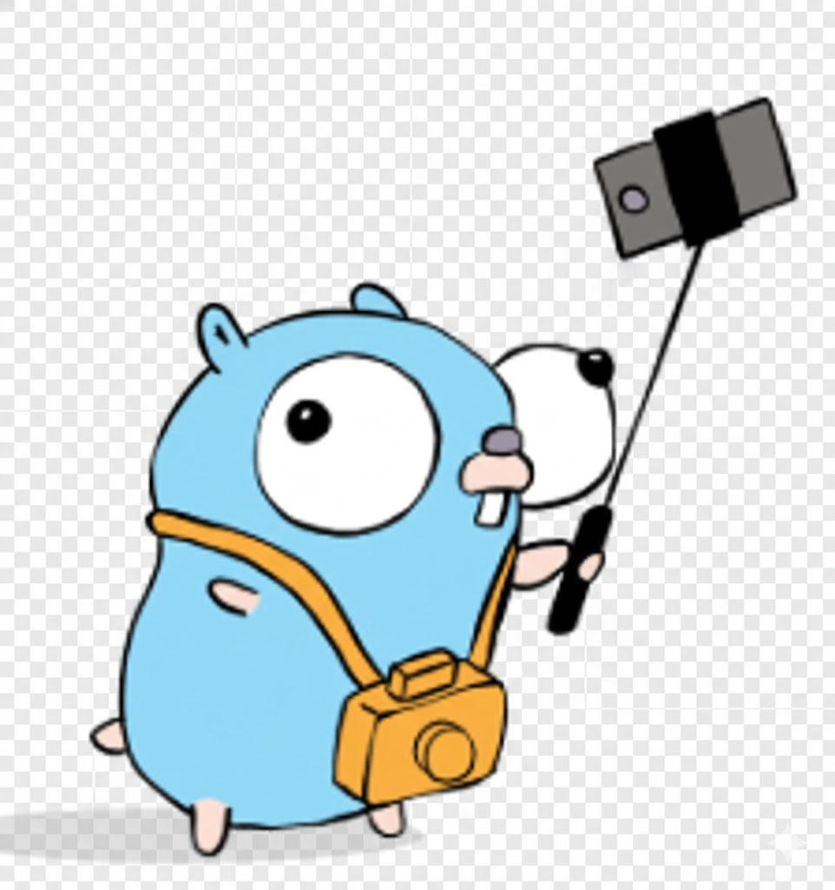

# Google Shot 📸

 

Pequena ferramenta em Go que acessa uma página web (`https://www.google.com.br`), captura um **screenshot** em **PNG** e gera um **PDF** da página utilizando o **Chrome em modo headless** via [chromedp](https://github.com/chromedp/chromedp).



---

## ✨ Funcionalidades

- Acessa uma URL (atualmente: `https://www.google.com.br`)
- Aguarda o carregamento da página
- Gera:
  - `google.png` – captura de tela da página (screenshot)
  - `google.pdf` – versão em PDF da página
- Tudo feito em modo headless, sem abrir janela do navegador.

---

## 🧰 Tecnologias utilizadas

- [Go](https://go.dev/) (Golang)
- [chromedp](https://github.com/chromedp/chromedp)
- [cdproto/page](https://github.com/chromedp/cdproto)

---

## 📦 Pré-requisitos

- Go instalado (versão 1.20+ recomendada)  
- Google Chrome ou Chromium instalado no sistema

Para verificar o Go:

```bash
go version
